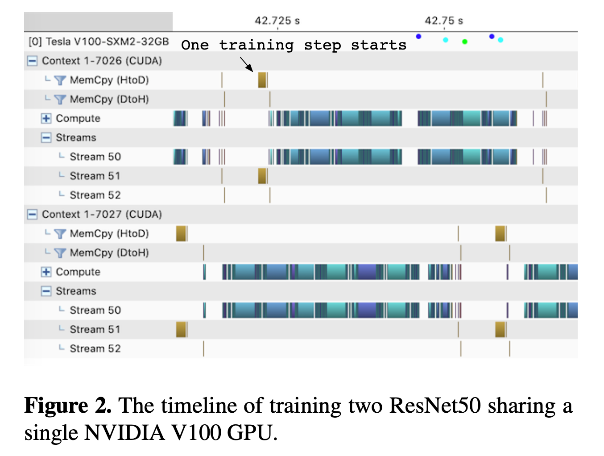
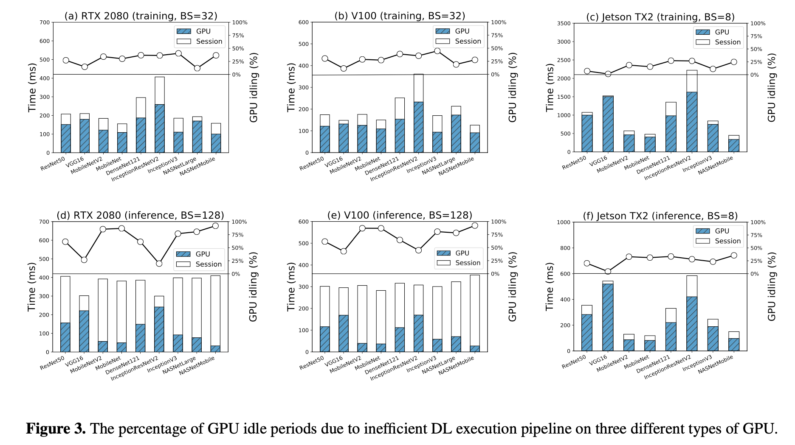
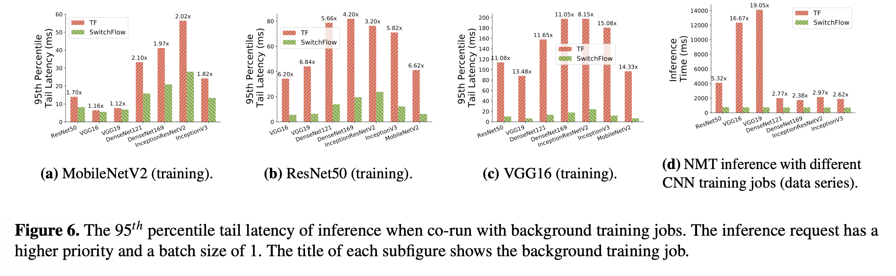
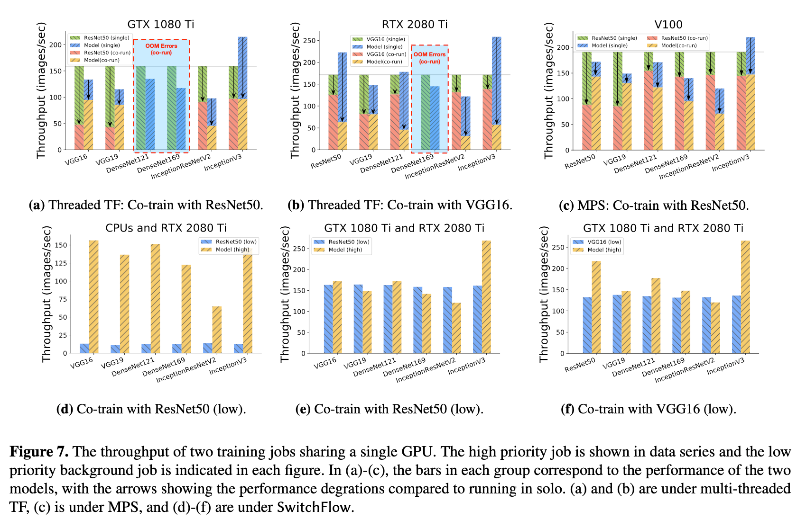
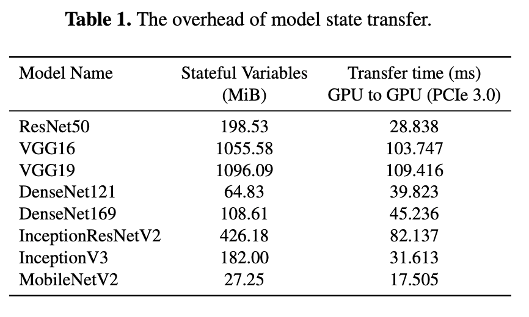
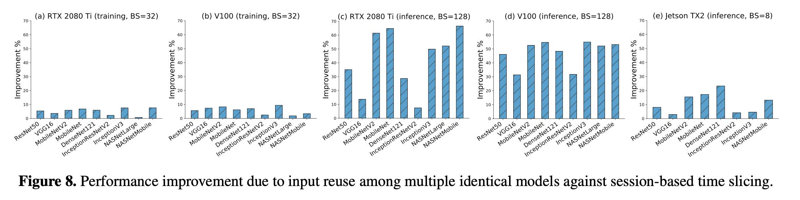
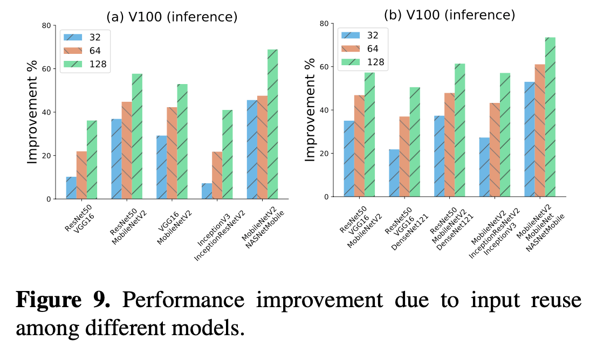

# Getting Started

# System requirement
- anaconda
- python 3.6

More details about dependency can be found on the page of TF Build from source: https://www.tensorflow.org/install/source.
The project is based on the TensorFlow 1.13.(https://github.com/shizukanaskytree/tensorflow)

# Experiment in Figure 2



To reproduce the experiment in Figure 2, checkout to `add_2_streams_experiment`.

| git         | Description                               |
| ----------- | ----------------------------------------- |
| branch      | add_2_streams_experiment                  |


(https://github.com/shizukanaskytree/tensorflow/tree/add_2_streams_experiment), and build by following the commands below:

```bash
bazel build --config=opt \
            --cxxopt="-D_GLIBCXX_USE_CXX11_ABI=0" \
            --config=cuda \
            //tensorflow/tools/pip_package:build_pip_package

tensorflow/bazel-bin/tensorflow/tools/pip_package/build_pip_package --nightly_flag /tmp/tensorflow_pkg

# uninstall the tensorflow if it is installed before.
pip uninstall --yes /tmp/tensorflow_pkg/tf_nightly-1.13.1-cp36-cp36m-linux_x86_64.whl

pip install /tmp/tensorflow_pkg/tf_nightly-1.13.1-cp36-cp36m-linux_x86_64.whl
```

Benchmark code of the timeline of training two ResNet50 sharing a single NVIDIA V100 GPU is in [benchmarks/timeline_train_two_resnet50_v100](benchmarks/timeline_train_two_resnet50_v100),

Open one terminal and execute:

```bash
bash run_resnets.sh
```

Open another terminal and execute:

```bash
bash run_profiling.sh
```

# Experiments in Figure 3, 6, 7



To reproduce the experiment in Figure 3, checkout to

| git         | Description                               |
| ----------- | ----------------------------------------- |
| branch      | `executors_to_take_step_turn`             |
| commit      | `e08ba55891fcc0d3aa828084a4198e7c5e1db9d9`|

(https://github.com/shizukanaskytree/tensorflow/tree/e08ba55891fcc0d3aa828084a4198e7c5e1db9d9), and build by following the commands above.

To compile TF code for Jetson TX2, please refer to https://developer.nvidia.com/embedded/jetpack and cross-compilation for TX2.

Benchmark code of Figure 3 is in [benchmarks/experiment](benchmarks/experiment).

The percentage data reported in Figure 3 is computed by the duration time collected from [TensorFlow Timeline profiling tool](https://towardsdatascience.com/howto-profile-tensorflow-1a49fb18073d).



To reproduce the experiment in Figure 6, checkout to

| git         | Description                               |
| ----------- | ----------------------------------------- |
| branch      | `executors_to_take_step_turn`             |
| commit      | `21fa0bde1618de3514f5befb69de548b4771fecf`|

(https://github.com/shizukanaskytree/tensorflow/tree/e08ba55891fcc0d3aa828084a4198e7c5e1db9d9), and build by following the commands above.

To execute:

```
python launch.py
```



Figure7 shows the throughput of two training jobs sharing a single GPU.
Co-training benchmark code is in [benchmarks/experiment](benchmarks/experiment).
Benchmark code of MPS experiment in Figure 7 is in [benchmarks/mps](benchmarks/mps).

MPS experiment is conducted by executing:

Start MPS first,
```
benchmarks/mps/start_mps.sh
```

Run main 1 in one terminal, run main 2 in another terminal.

```
bash run_main1.sh
bash run_main2.sh
```

# Experiment in Table 1



The overhead of model state transfer is measured in the function of:
`DirectSession::TransferGPU2CPUStatefulVars()`, `DirectSession::TransferCPU2GPUStatefulVars()`, `DirectSession::TransferHPU2LPUStatefulVars()`, `DirectSession::TransferLPU2HPUStatefulVars()`
in the file `tensorflow/tensorflow/core/common_runtime/direct_session.cc`.

# Experiments in Figure 8, 9, 10




To reproduce the experiment in Figure 8, 9 10, checkout to

| git         | Description                               |
| ----------- | ----------------------------------------- |
| branch      | `executors_to_take_step_turn`             |
| commit      | `7756874638567e7b333d66e4ae9ed73c4e23689f`|


(https://github.com/shizukanaskytree/tensorflow/tree/7756874638567e7b333d66e4ae9ed73c4e23689f), and build by following the commands above.

Benchmark code of Figure 8, 9, 10 are in [benchmarks/reuse_inputs](benchmarks/reuse_inputs).
